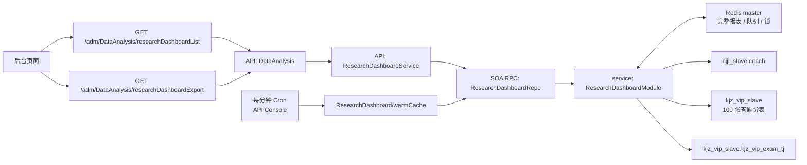

## 问题

### 教研数据看板

教研数据看板sql查询太慢了，1.是缓存策略没做到位，2.是要建聚合表

目前缓存策略是，每次点查询只缓存合计，现在要改成缓存整个列表，如果筛选条件不变，复用缓存内容，并且查询时，后台启动一个定时任务，用来消费前端生产的查询任务，前端1s轮询，缓存有无更新，有则刷新列表，

### 评论管理

目前题目评论有点问题，测试app上看不到已有评论

## work

上线了兼职管理到正式环境，

优化教研数据看板缓存策略